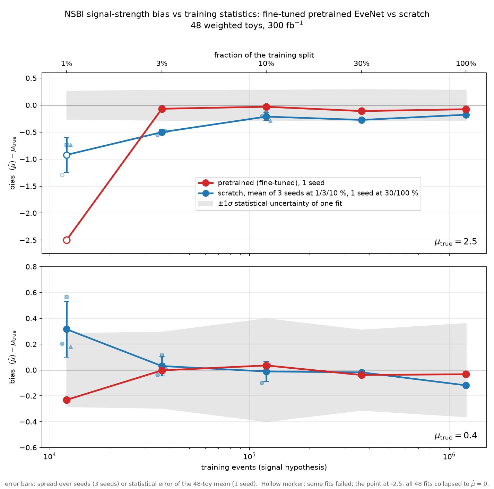

# EveNet NSBI training-statistics scan

How much training data does a pretrained EveNet need, compared with the same network trained from scratch, before an NSBI measurement of the signal strength μ in gg → (h* →) ZZ → 4ℓ is unbiased? The two CARL classifiers (S/B and SBI/B) are trained on 1, 3, 10, 30 and 100 % of the training split, and the fitted μ is compared with the truth on 48 pseudo-experiments each at μ = 0.4 and μ = 2.5 (300 fb⁻¹).

## Setup

- Samples: MCFM signal, background and full process (SBI). Validation split, toys and calibration reference are the same for every point.
- Fit: calibrated density ratios in the mixture likelihood ratio, NLL(μ) scanned over [0, 4], best fit and 1σ interval per toy. Figure of merit: bias = mean(μ̂) − μ_true.
- Scratch: EveNet-Lite (about 20M parameters) from random init, lr 3e-4, early stopping on the validation loss. 3 seeds at 1, 3 and 10 %, 1 seed at 30 and 100 %.
- Pretrained: the public EveNet checkpoint, all layers fine-tuned (lr 1e-4 / 5e-5 / 1e-5 for head / object encoder / body), 20 full passes, S/B checkpoint = the saved epoch with the lightest ratio tail on the validation background. 1 seed.
- Frozen backbone (head only) as a control.

## Result

- From 3 % of the data up, both models recover the true μ within or close to the statistical uncertainty, at μ = 0.4 and at μ = 2.5.
- At 1 % of the data neither model works.
- At μ = 2.5 pretrained is closer to the truth (scratch sits about 0.2 low from 10 % up, and 0.5 low at 3 %).
- The pretrained failure seen earlier came from training its classifier for too long, not from the pretraining itself: with best-validation or last-epoch checkpoints the fine-tuned S/B ratio develops heavy tails that pin the fits at μ = 1 or μ = 0.

Caveats: the fine-tuned curve is one seed and its checkpoint rule was chosen after the fact; part of the gap at μ = 2.5 comes from the fine-tuned SBI/B classifier being trained longer than the early-stopped scratch one. Tables, per-seed numbers and diagnostics: [docs/results.md](docs/results.md). The poster this started from: [docs/poster_nsbi_evenet.pdf](docs/poster_nsbi_evenet.pdf).

## Contents

- `nsbi_scan.py`: all shared code. `run_scan.py`, `remote_setup.sh`, `scan_config.json`: GPU-box driver, setup, configuration.
- `00_*.ipynb` to `03_*.ipynb`: data cache, training, measurement, plots.
- `tools/`: the later studies (annealing test, full-schedule ladder, poster checkpoints) and the figure scripts.
- `measurements*.csv`, `aggregates*.csv`, `diagnostics/`: results of the early-stopped scan. `anneal/`, `fullsched/`: the later studies.
- `runs/`, `anneal/runs/`, `fullsched/runs/`: per-run metrics and loss histories. `logs/`: box logs.
- `figures/`, `docs/`.

Not included: the cached splits and toys (`data/*.npz`, rebuilt by notebook 00), the per-run ratio exports and the weights. The `tools/figs_*.py` scripts work from the CSV tables here; the profile scripts and `diag_tier2.py` need the ratio exports.

## Running

See [docs/running_the_scan.md](docs/running_the_scan.md). Training needs torch and [EveNet-Lite](https://github.com/Dekiofsa/EveNet-Lite); the measurement and figures need numpy, pandas and matplotlib.
